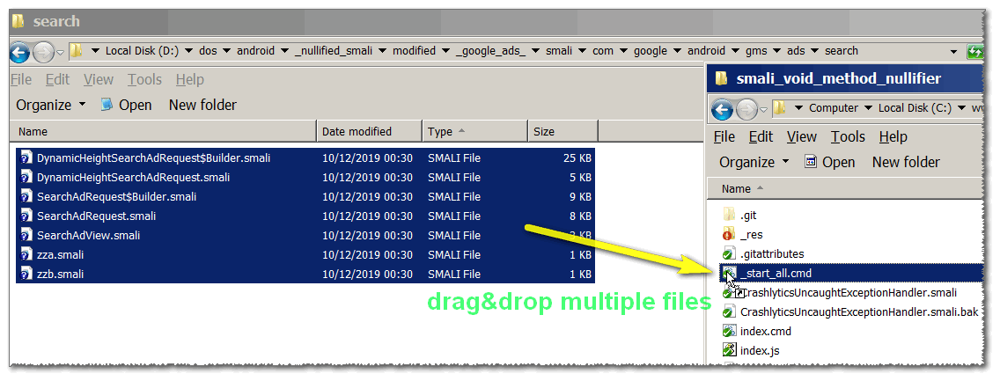
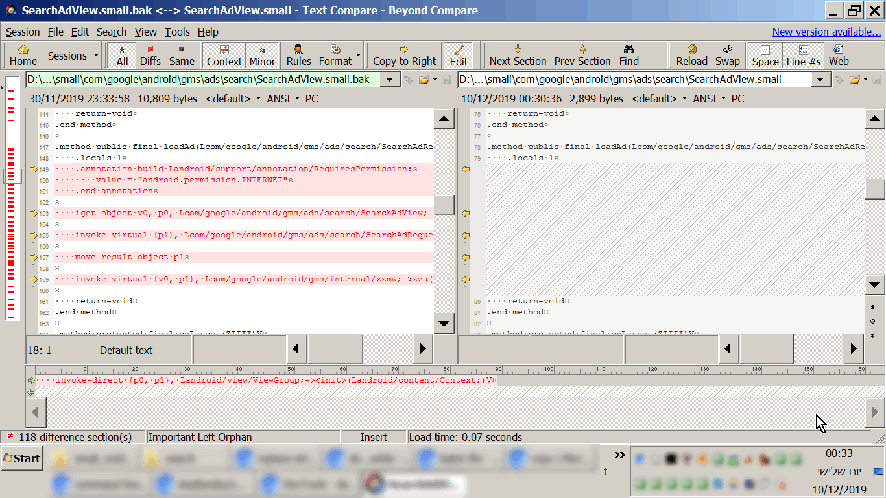
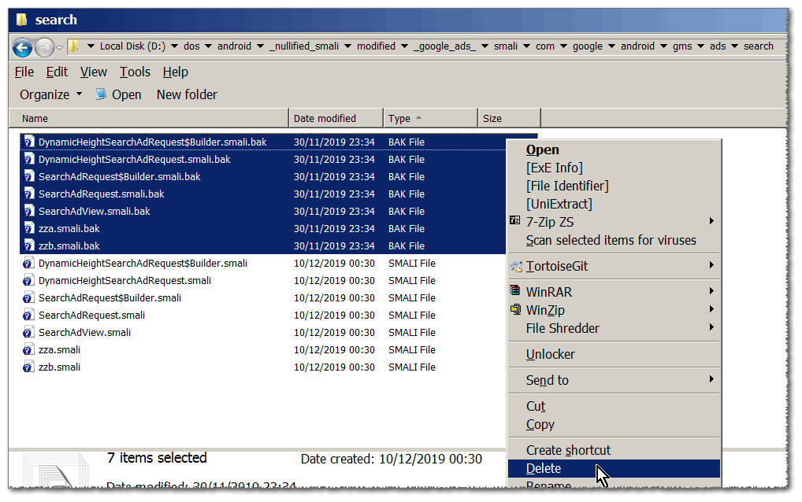

<h1>SMALI Void-Method Nullifier</h1>

<ol>
<li>
  backups original file to '.bak' .
</li>
<li>
  reads file-content (smali).
</li>
<li>
  some string manipulation (nullifies void-method's content, preserving '.locals...' line).
</li>
<li>
  writes back overwriting the file's-content.
</li>
</ol>

Will skip abstract methods or if for some reason it can't find '.locals' line, 
or other reasons that makes the method-textual-content invalid.

Useful tool in nullifying Android-lib-folders preserving method name and argument ("signature") but emptying it up.

You can compare <code>CrashlyticsUncaughtExceptionHandler.smali</code> and <code>CrashlyticsUncaughtExceptionHandler.smali.bak</code> to see the result (<code>.bak</code> is the original-file).

<strong>How to use</strong> - single file: drag&drop over <code>index.cmd</code> .

<strong>How to use</strong> - multiple file (keep under 10): drag&drop over <code>_start_all.cmd</code>, it will start in parallel.

<strong>Note1:</strong> 
the <code>index.cmd</code> file ends with <code>exit</code> (and not <code>exit /b</code>) so it will exit properly if used from within <code>_start_all.cmd</code> which calls it in parallel (using <code>start /cmd c</code> which does not ends properly when sub-batch-file ends with just <code>exit /b</code>), 
this might make your CMD window to closed-down if run manually.

<strong>Note2:</strong> 
I'm using a lot of <code>.indexOf</code> instead of regular-expressions, 
it's faster but that's not the reason, 
there is a problem matching multiple results with groups in JavaScripts, 
and multiline-characters such as \r and \n making it extra buggy.

For example I was nullifying the files from <code>google/gms/ads</code>, 
from my <a href="https://github.com/eladkarako/nullified_smali">https://github.com/eladkarako/nullified_smali</a> repository.

   
   
   
